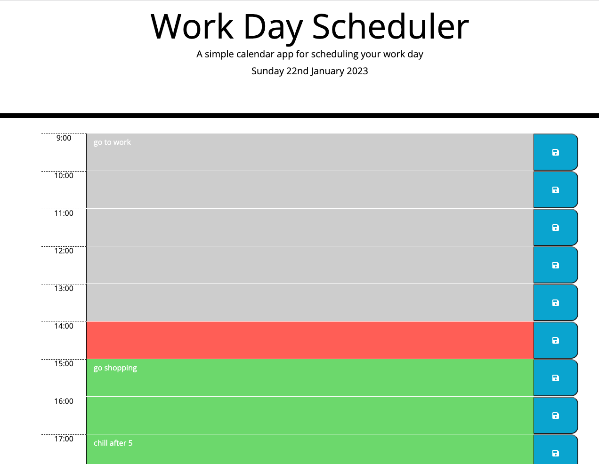

# Work Day Scheduler

## Description
The aim of this task is to create a day scheduler that will allow a user to save events for each hour of the day. This will all be achieved by dynamically updating the HTML and CSS using jQuery. Moment.js will also be used to set the current day and time. 

## Mockup
The image below shows an image of the working application.

## Review
After completing the logic in the JavaScript file current day is displayed at the top of the calender when a user opens the planner and present timeblocks for standard business hours when the user scrolls down. Each timeblock has its own colour based on past, present, and future when the timeblock is viewed and users can enter and save an event by clicking the save button, which saves it in local storage. It also presents the data saved from local storage in the browser.

## Deployment

[Coading Quiz Application - https://wmohammad83.github.io/work-day-scheduler/](https://wmohammad83.github.io/work-day-scheduler/)

## Resources Used

- [Markdown Badges](https://github.com/Ileriayo/markdown-badges)
- [Google](https://www.google.co.uk)

